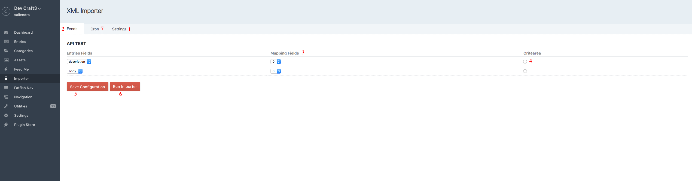
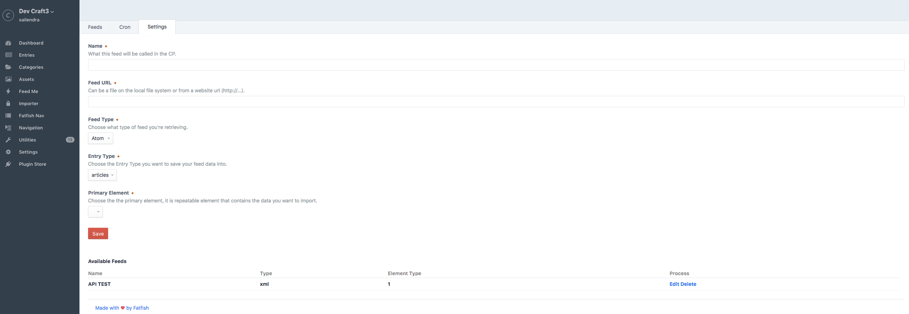
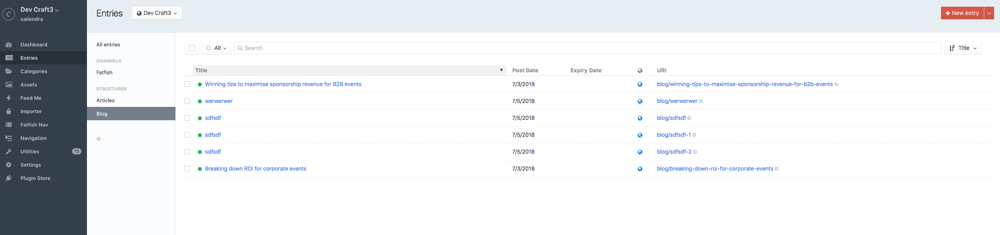

# importer plugin for Craft CMS 3.x

XML importer

## Requirements

This plugin requires Craft CMS 3.0.0-beta.23 or later.

## Installation

To install the plugin, follow these instructions.

1. Install latest version of curl visit **https://curl.haxx.se/docs/** for details
2. Open your terminal and go to your Craft project:

        cd /path/to/project

3. Then tell Composer to load the plugin:

        composer require github.com/fatfish/importer

4. In the Control Panel, go to Settings → Plugins and click the “Install” button for importer.

## importer Overview
XML Importer allow user to import xml data from api.
     

## Configuring importer

1. First of all Create a Custom Entries you like. could be blog, article with custom fields you like.
2. Click on importer menu on your left hand side. you will be presented with 3 tabs. CastleFord,Feeds,Cron,FeedSettings.
3. Click on FeedSettings, you will be presented with two more tabs one more CastleFord and another for generic XML.
4. If you have castleford api enter details otherwise enter your generic xml api details on Feeds tab. And Save 
5. Click on importer menu once saved. Saved Xml Feeds will appear in respective tab. Castleford xml feeds will appear in Castlford feed.
    Generic XML feeds will appear in feeds tab. It wll display field mapping area try to map necessary field as you like then save  the 
    settings and click on run importer to import data from xml feed.
6. Click on Cron tab if you want to configure cron job to run it as cron job.

## Using importer

 

 

## importer Roadmap

More to come on future.

##bug
Please feel free to report bugs or issues you have. For suggestion you can email us on admin@fatfish.com.au

Brought to you by [Fatfish] **https://fatfish.com.au**
